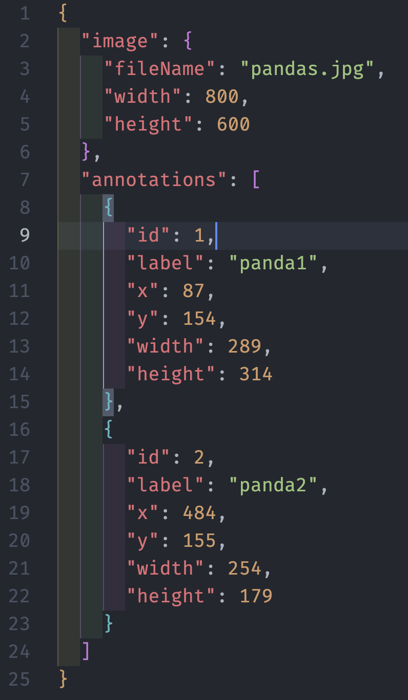

# 🎨 Image Annotator

A full-stack image annotation tool with AI-powered auto-labeling capabilities. Built with React, Node.js, PostgreSQL, and OpenAI Vision API.

[](https://image-annotator-theta.vercel.app)
[](https://image-annotator-backend.onrender.com)
[](LICENSE)


> **Note:** Backend is deployed on Render's free tier and may take 30-60 seconds to wake up on first request.

---

## ✨ Features

### 🎯 Core Annotation Tools

- **Multi-Image Management** - Upload and manage multiple images with independent annotation data
- **Precise Bounding Boxes** - Draw accurate annotation boxes with mouse interactions
- **Smart Labeling** - Add, edit, and delete labels for each annotation
- **Undo/Redo** - Per-image history tracking with keyboard shortcuts (Cmd/Ctrl+Z)
- **Auto-Save** - Annotations automatically sync to backend database
- **JSON Export** - Export annotations in COCO format

### 🤖 AI-Powered Features

- **AI Auto-Labeling** - Automatic object detection using GPT-4 Vision API (optional)
- **Color-Coded Annotations** - Each annotation gets a unique color for easy identification

### 🎨 User Experience

- **Modern UI** - Glass-morphism design with purple gradient theme
- **Responsive Layout** - Three-panel interface optimized for workflow
- **Real-time Feedback** - Toast notifications for all operations
- **Error Handling** - Error boundary with graceful fallbacks
- **Performance Optimized** - React.memo for efficient rendering

---

## 🚀 Live Demo

**Try it now:** [https://image-annotator-theta.vercel.app](https://image-annotator-theta.vercel.app)

**API Documentation:** [https://image-annotator-backend.onrender.com/health](https://image-annotator-backend.onrender.com/health)

---

## 📸 Screenshots

### Main Interface


_Three-panel workspace: image list (left), annotation canvas (center), annotation management (right)_

### AI Auto-Labeling


_AI-powered automatic object detection with GPT-4 Vision_

### Annotation Management


_Edit labels, view coordinates, and manage all annotations_

### Multi-Image Support


_Switch between multiple images with independent annotation data_

### Delete Confirmation


_Confirmation dialog prevents accidental deletion of images and annotations_

### Error Handling


_Error boundary catches unexpected errors and provides graceful fallback UI_

### JSON Export


*Export annotations in COCO format for machine learning and data analysis*

---

## 🛠️ Tech Stack

### Frontend

| Technology      | Purpose          | Version |
| --------------- | ---------------- | ------- |
| React           | UI Framework     | 19.x    |
| TypeScript      | Type Safety      | 4.x     |
| Zustand         | State Management | 5.x     |
| Tailwind CSS    | Styling          | 3.x     |
| Canvas API      | Drawing          | Native  |
| react-hot-toast | Notifications    | 2.x     |

### Backend

| Technology | Purpose          | Version |
| ---------- | ---------------- | ------- |
| Node.js    | Runtime          | 18.x    |
| Express    | Web Framework    | 4.x     |
| PostgreSQL | Database         | 15.x    |
| Multer     | File Upload      | 1.x     |
| Sharp      | Image Processing | 0.33.x  |

### AI Integration

- **OpenAI API** - GPT-4 Vision (gpt-4o-mini) for object detection
- **Base64 Encoding** - Image format conversion for API compatibility

### Deployment

- **Frontend:** Vercel (Free tier)
- **Backend:** Render (Free tier)
- **Database:** Render PostgreSQL (Free tier)

---

## 📦 Getting Started

### Prerequisites

- Node.js 16+
- PostgreSQL 12+
- npm or yarn

### Backend Setup

1. **Clone and navigate:**

```bash
git clone https://github.com/zackJin1224/Image-annotator.git
cd Image-annotator/backend
```

2. **Install dependencies:**

```bash
npm install
```

3. **Create database:**

```bash
createdb image_annotation
psql -d image_annotation -f schema.sql
```

4. **Configure environment:**

```bash
cp .env.example .env
# Edit .env with your database credentials
```

5. **Start server:**

```bash
npm start
```

Server runs at `http://localhost:5001`

### Frontend Setup

1. **Navigate and install:**

```bash
cd ../frontend
npm install
```

2. **Configure API endpoint:**

```bash
# Create .env file (optional for local development)
REACT_APP_API_BASE_URL=http://localhost:5001
```

3. **Start development server:**

```bash
npm start
```

Application runs at `http://localhost:3000`

---

## 🎮 Usage Guide

### Basic Workflow

1. **Upload Images**

   - Click "📤 Upload Image" button
   - Select one or multiple images
   - Images appear in left sidebar

2. **Create Annotations**

   - Click and drag on canvas to draw bounding box
   - Enter label in popup input
   - Press Enter to confirm, Escape to cancel

3. **Manage Annotations**

   - View all annotations in right panel
   - Click label to edit
   - Click X to delete
   - Use Delete key to remove selected annotation

4. **Keyboard Shortcuts**

```
   Cmd/Ctrl + Z          Undo
   Cmd/Ctrl + Shift + Z  Redo
   Delete/Backspace      Delete selected annotation
   Escape                Cancel current action
   Enter                 Confirm label input
```

5. **AI Auto-Labeling** (Optional)

   - Click "✨ AI Auto-label" button
   - Wait 5-10 seconds for processing
   - AI automatically detects objects and creates annotations

6. **Export Data**
   - Click "📥 Export JSON" button
   - Downloads COCO-format annotation file
   - Includes image metadata and bounding box coordinates

### Tips & Tricks

- Annotations auto-save after each change
- Each image maintains independent annotation history
- Refresh page to verify data persistence
- Click image thumbnail to quickly switch between images

---

## 🏗️ Architecture

### Database Schema

```sql
-- Images table
CREATE TABLE images (
    id UUID PRIMARY KEY DEFAULT gen_random_uuid(),
    file_name VARCHAR(255) NOT NULL,
    file_path VARCHAR(500) NOT NULL,
    file_size INTEGER,
    width INTEGER,
    height INTEGER,
    created_at TIMESTAMP DEFAULT CURRENT_TIMESTAMP,
    updated_at TIMESTAMP DEFAULT CURRENT_TIMESTAMP
);

-- Annotations table
CREATE TABLE annotations (
    id UUID PRIMARY KEY DEFAULT gen_random_uuid(),
    image_id UUID REFERENCES images(id) ON DELETE CASCADE,
    start_x FLOAT NOT NULL,
    start_y FLOAT NOT NULL,
    end_x FLOAT NOT NULL,
    end_y FLOAT NOT NULL,
    label VARCHAR(100) NOT NULL,
    created_at TIMESTAMP DEFAULT CURRENT_TIMESTAMP,
    updated_at TIMESTAMP DEFAULT CURRENT_TIMESTAMP
);

-- Indexes for performance
CREATE INDEX idx_annotations_image_id ON annotations(image_id);
CREATE INDEX idx_images_created_at ON images(created_at);
```

### API Endpoints

#### Images

```
GET    /api/images           - List all images
GET    /api/images/:id       - Get image with annotations
POST   /api/images           - Upload new image
DELETE /api/images/:id       - Delete image (cascade)
```

#### Annotations

```
GET    /api/images/:imageId/annotations          - Get image annotations
POST   /api/images/:imageId/annotations          - Create annotation
PUT    /api/images/:imageId/annotations          - Replace all annotations
PUT    /api/annotations/:id                      - Update annotation
DELETE /api/annotations/:id                      - Delete annotation
```

### State Management

**Zustand Store Structure:**

```typescript
interface AnnotationStore {
  images: ImageData[]; // All uploaded images
  currentImageIndex: number; // Active image index
  imageHistories: Map<string, History>; // Per-image undo/redo stacks

  // Actions
  loadImages: () => Promise<void>;
  addImage: (file: File) => Promise<void>;
  selectImage: (index: number) => void;
  deleteImage: (index: number) => Promise<void>;
  setAnnotations: (boxes: Box[]) => void;
  saveAnnotations: () => Promise<void>;
  undo: () => void;
  redo: () => void;
}
```

---

## 🤖 AI Integration

### How It Works

1. **Image Preparation**

   - Convert image URL to Base64 format
   - Required because OpenAI cannot access localhost URLs

2. **API Call**

```typescript
const response = await openai.chat.completions.create({
  model: "gpt-4o-mini",
  messages: [
    {
      role: "user",
      content: [
        { type: "text", text: "Detect objects and return bounding boxes..." },
        { type: "image_url", image_url: { url: base64Image } },
      ],
    },
  ],
});
```

3. **Result Processing**
   - Parse JSON response
   - Convert percentage coordinates to pixels
   - Create annotations with random colors
   - Auto-save to database

### Configuration

**Development (with AI):**

```env
REACT_APP_AI_ENABLED=true
REACT_APP_OPENAI_API_KEY=your_api_key_here
```

**Production (without AI):**

```env
REACT_APP_AI_ENABLED=false
```

### Cost Analysis

- Model: gpt-4o-mini
- Cost: ~$0.001 per image (0.1 cents)
- $5 credit = ~5000 image analyses

---

## 🚀 Deployment

### Backend (Render)

1. **Create PostgreSQL Database**

   - Choose free tier
   - Note the Internal Database URL

2. **Create Web Service**

   - Connect GitHub repository
   - Root directory: `backend`
   - Build: `npm install`
   - Start: `npm start`

3. **Environment Variables**

```env
   DATABASE_URL=your_postgres_url
   NODE_ENV=production
```

4. **Automatic Table Creation**
   - Tables are created automatically on first run
   - See `src/server.js` for schema initialization

### Frontend (Vercel)

1. **Import Project**

   - Select GitHub repository
   - Framework: Create React App
   - Root directory: `frontend`

2. **Build Settings**

```
   Build Command: npm run build
   Output Directory: build
```

3. **Environment Variables**

```env
   REACT_APP_API_BASE_URL=https://your-backend.onrender.com
```

4. **Deploy**
   - Automatic deployment on every push to main branch

---

## 🐛 Troubleshooting

### Backend Issues

**Problem:** Database connection failed  
**Solution:** Verify `DATABASE_URL` in environment variables

**Problem:** CORS errors  
**Solution:** Check allowed origins in `server.js`

**Problem:** Images not loading  
**Solution:** Verify `uploads/` directory exists and has write permissions

### Frontend Issues

**Problem:** API requests failing  
**Solution:** Check `REACT_APP_API_BASE_URL` is set correctly

**Problem:** Annotations disappearing  
**Solution:** Ensure auto-save is working (check browser console)

**Problem:** Build errors  
**Solution:** Delete `node_modules` and run `npm install` again

---

## 🎯 Future Enhancements

### Planned Features

- [ ] User authentication (JWT)
- [ ] Polygon and polyline annotations
- [ ] Annotation templates
- [ ] Collaboration features
- [ ] Advanced export formats (YOLO, Pascal VOC)
- [ ] Image preprocessing tools
- [ ] Annotation statistics dashboard
- [ ] Batch operations
- [ ] Keyboard shortcut customization

### Technical Improvements

- [ ] Unit tests (Jest + React Testing Library)
- [ ] E2E tests (Cypress)
- [ ] API documentation (Swagger)
- [ ] Docker containerization
- [ ] CI/CD pipeline
- [ ] Performance monitoring

---

## 📊 Project Metrics

| Metric           | Value                       |
| ---------------- | --------------------------- |
| Development Time | 20 days                     |
| Lines of Code    | ~1,200 (excluding comments) |
| Components       | 5                           |
| API Endpoints    | 8                           |
| Database Tables  | 2                           |
| Git Commits      | 30+                         |

---

## 📚 Learning Resources

If you're interested in building something similar, here are the key concepts:

### Frontend

- [React Official Docs](https://react.dev/)
- [Zustand State Management](https://zustand-demo.pmnd.rs/)
- [Canvas API Tutorial](https://developer.mozilla.org/en-US/docs/Web/API/Canvas_API)
- [TypeScript Handbook](https://www.typescriptlang.org/docs/)

### Backend

- [Express.js Guide](https://expressjs.com/en/guide/routing.html)
- [PostgreSQL Tutorial](https://www.postgresql.org/docs/current/tutorial.html)
- [Multer Documentation](https://github.com/expressjs/multer)

### Deployment

- [Vercel Deployment](https://vercel.com/docs)
- [Render Documentation](https://render.com/docs)

---

## 🤝 Contributing

Contributions are welcome! Please feel free to submit a Pull Request.

### Development Workflow

1. Fork the repository
2. Create your feature branch (`git checkout -b feature/AmazingFeature`)
3. Commit your changes (`git commit -m 'Add some AmazingFeature'`)
4. Push to the branch (`git push origin feature/AmazingFeature`)
5. Open a Pull Request

---

## 📄 License

This project is licensed under the MIT License - see the [LICENSE](LICENSE) file for details.

---

## 👨‍💻 Author

**Zijing Jin**

- 🎓 MS in Information Science @ University of Pittsburgh
- 💼 [LinkedIn](https://www.linkedin.com/in/zijing-jin1224)
- 🐙 [GitHub](https://github.com/zackJin1224)
- 📧 Email: zachjin1224@gmail.com

### About This Project

This project was built as part of my journey to become a full-stack developer. It demonstrates:

- Strong frontend skills (React, TypeScript, state management)
- Backend development (Node.js, Express, PostgreSQL)
- AI integration (OpenAI Vision API)
- Production deployment (Vercel, Render)
- Problem-solving and architecture decisions

---

## 🙏 Acknowledgments

- [OpenAI](https://openai.com/) for GPT-4 Vision API
- [Render](https://render.com/) for backend hosting
- [Vercel](https://vercel.com/) for frontend hosting
- [React](https://react.dev/) and [TypeScript](https://www.typescriptlang.org/) communities
- All the developers whose open-source projects made this possible

---

## 📮 Contact

Have questions or suggestions? Feel free to:

- 📧 Email me at zachjin1224@gmail.com
- 💬 Open an issue on GitHub
- 🤝 Connect on [LinkedIn](https://www.linkedin.com/in/zijing-jin1224)

---

<div align="center">

**⭐ If you find this project helpful, please give it a star! ⭐**

</div>
